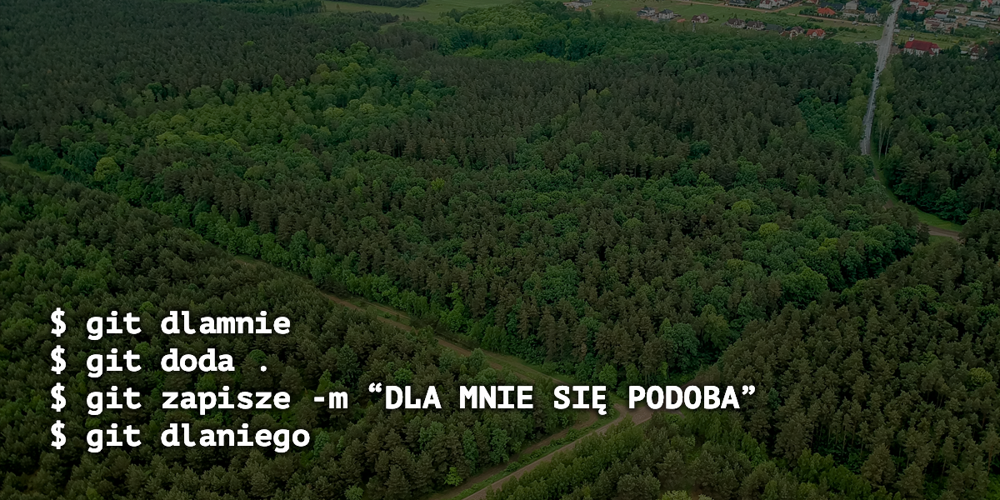

# Dla mnie podlaskie jest GIT.



Dodaj podlaskiego smaku do swoich projektów! Zamiast wymysłu zachodniej cywilizacji skorzystaj z lokalnych komend!

Aby tego dokonać, jedyne co musisz zrobić to dodać następujące linijki do swojego pliku ~/.gitconfig

```
[alias]
	doda = add
	dodadlamnie = add
	bambarylo = blame
	sprawdzikto = blame
	kij = branch
	powieli = clone
	powielidlamnie = clone
	otako = commit
	tako = commit
	zapisze = commit
	zapiszedlamnie = commit
	skoczy = checkout
	sprowadzi = fetch
	sprowadzidlamnie = fetch
	dawaj = init
	sljedzi = log
	zlepi = merge
	zlepidlamnie = merge
	dlamnie = pull
	dadlamnie = pull
	dlaniego = push
	dadlaniego = push
	nietutejszy = remote
	inszy = remote
	akalice = remote
	cofnie = revert
	cofniedlamnie = revert
	nazad = revert
	nie-e = reset
	akomutopotrzebne = reset HEAD --hard
	adlakogotopotrzebne = reset HEAD --hard
	niebedzieniczego = reset HEAD --hard
	pokaze = show
	pokazedlamnie = show
	baryk = stash
	dobaryka = stash
	cosiestalosie = status
```


Zapraszam do kontrybucji i zgłaszania pomysłów na kolejne komendy! 

**JEŚLI TO REPOZYTORIUM DLA CIEBIE SIĘ PODOBA - ZOSTAW DLA MNIE GWIAZDKĘ ⭐️**

W tworzeniu aliasów pomagali dla mnie: 

- [Konrad Karpieszuk](https://github.com/kkarpieszuk)
- [Mikolaj Kaminski](https://github.com/mikasjp)
- [Michał Jarosz](https://github.com/Mchl)
- [Jacek Dargiel](https://github.com/jacek-dargiel)
- [Adam Jakubowski](https://github.com/ajakubo1)
- [grocal](https://github.com/grocal)
- [Michał Jadwiszczak](https://github.com/MichalJadwiszczak)
- Natalia Cudna


